# 👋 Halo, Saya Warnadi (Adi)
###  Full-Stack Developer & Software Engineer

  <!-- Badge TOTAL STARS Semua Repo Kamu (Dinamis & Otomatis) -->
  
  
  <!-- Badge TOTAL FOLLOWERS Akun Kamu -->
  

Saya seorang pengembang perangkat lunak asal **Indonesia**. Saya memiliki ketertarikan mendalam pada pengembangan sistem backend, arsitektur database, optimasi performa kueri, keamanan jaringan, dan dunia open-source. Saya terbiasa membangun solusi teknologi di berbagai platform, mulai dari web, mobile, hingga desktop dan sistem Linux.

---

### 🛠️ Teknologi & Keahlian (Tech Stack)

<table align="center" width="100%">
  <tr>
    <td valign="top" width="50%">
      <h4>🌐 Web & Backend Development</h4>
      
      
      
      
      
    </td>
    <td valign="top" width="50%">
      <h4>🗄️ Database & SQL Management</h4>
      
      
      
    </td>
  </tr>
  <tr>
    <td valign="top" width="50%">
      <h4>📱 Mobile & OS Development</h4>
      
      
      
      
    </td>
    <td valign="top" width="50%">
      <h4>⚙️ System Programming (Basics)</h4>
      
      
      
    </td>
  </tr>
</table>

---

### 📦 Proyek Open-Source Unggulan
* **[db-stressmit](https://github.com/NadiWarnadi/db-stressmit)** - Smart database query benchmark, heuristic security auditor, and stress tester for PHP and Laravel.

### 🌱 Fokus saat Ini
* Mendalami arsitektur jaringan internet modern (*networking*), keamanan siber (*cybersecurity*), dan optimasi kueri database tingkat lanjut.
* Terbuka untuk kolaborasi pada proyek full-stack, perkakas (*tools*) pengujian backend, dan kontribusi open-source.

---
### 📊 Statistik GitHub Saya

### 📊 Statistik GitHub Saya

<table align="center" border="0" cellpadding="0" cellspacing="0" width="100%">
  <tr>
    <td valign="top" width="50%">
      <!-- Statistik Utama -->
      
    </td>
    <td valign="top" width="50%">
      <!-- Kontribusi Streak -->
      
    </td>
  </tr>
  <tr>
    <td colspan="2" align="center" valign="top" width="100%">
       
      <!-- Real-Time Persentase Bahasa Pemrograman -->
      
    </td>
  </tr>
</table>

---

### 📬 Mari Terhubung
* 📍 **Lokasi:** Cirebon, Jawa Barat, Indonesia
* 📧 **Email:** warnadi2006@gmail.com
* ⚡ **Fun Fact:** Suka ngulik optimasi sistem dan *query* database tengah malam demi efisiensi milidetik.

---

Terima kasih sudah berkunjung! Jangan ragu untuk melihat repositori saya dan meninggalkan bintang ⭐ jika kamu menyukai proyek saya.

